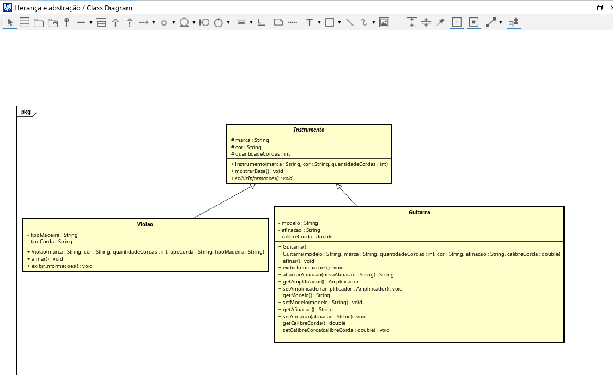
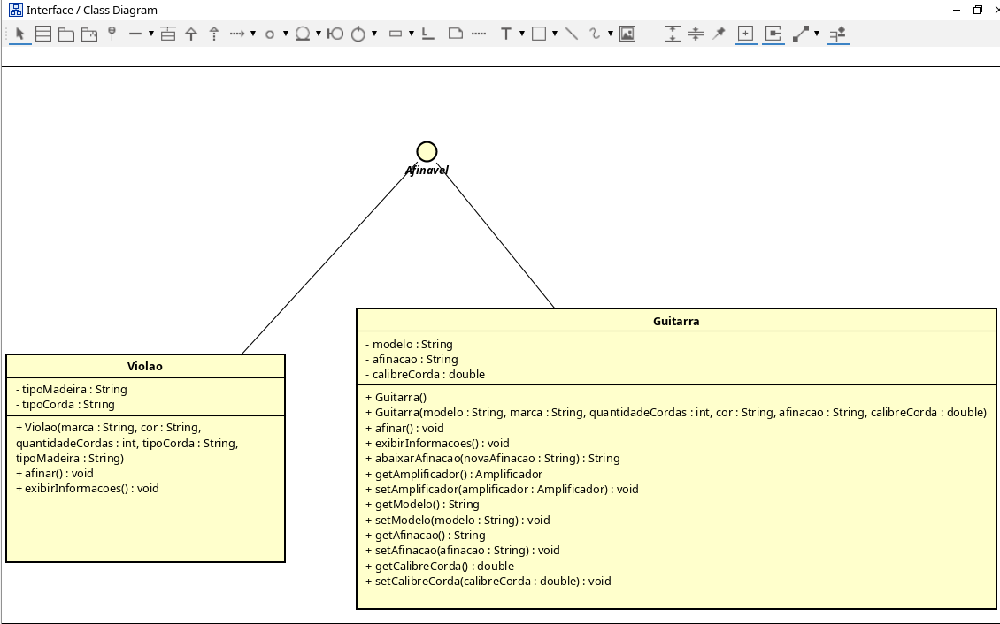
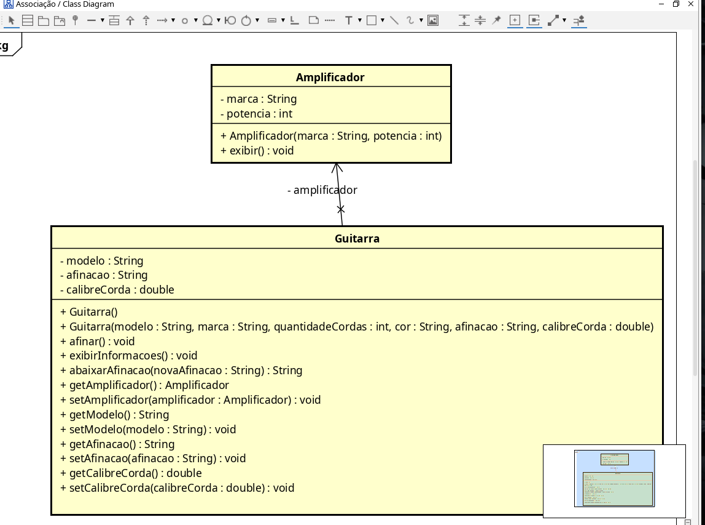

# Projeto FiapRide - João Vitor Lima Caldeira

## Informações do Aluno

- **Nome:** João Vitor Lima Caldeira
- **RM:** 566541
- **Turma:** 2CCPF
- **Curso:** Ciência da computação
- **GitHub:** @joaovitor-ti01

---

## Descrição do Projeto

Este projeto foi desenvolvido durante as aulas de Programação Orientada a Objetos, aplicando os conceitos das aulas 1-9 em um sistema de instrumentos musicais.

O projeto simula instrumentos como guitarras e violões, utilizando conceitos importantes da POO, como encapsulamento, herança, polimorfismo, abstração, interfaces e associação entre classes.

Além disso, foram implementadas algumas regras de negócio, como alteração de afinação de guitarras e associação com amplificadores.

---

## Checklist de Implementação

- [x] Aula 1 - Classes e Objetos
- [x] Aula 2 - Métodos
- [x] Aula 3 - Encapsulamento
- [x] Aula 4 - Construtores
- [x] Aula 5 - Associação
- [x] Aula 6 - Herança
- [x] Aula 7 - Polimorfismo
- [x] Aula 8 - Classes Abstratas
- [x] Aula 9 - Interfaces

---

## Arquitetura do Projeto (UML)

### 1. Herança e Abstração
Demonstra a especialização dos instrumentos.

### 2. Interface de Afinagem
Demonstra a implementação do contrato de afinagem.

### 3. Associação
Demonstra a conexão entre a Guitarra e o seu Amplificador.

---
# Perguntas de Reflexão

## Aula 1 - Classes e Objetos

**Pergunta:**  
Por que precisamos criar uma classe `Passageiro`? Não seria mais fácil apenas criar variáveis soltas no main?

### Sua Resposta:

No começo parece mais fácil criar tudo direto no main, mas isso vira uma bagunça muito rápido. Se tivesse muitos usuários no sistema, seria praticamente impossível organizar todas as informações manualmente. As classes ajudam justamente nisso, porque conseguimos criar vários objetos com os mesmos atributos e métodos sem repetir código toda hora. Isso deixa o sistema muito mais organizado e escalável.

---

## Aula 2 - Métodos

**Pergunta:**  
Por que criar métodos específicos em vez de alterar os valores diretamente?

### Sua Resposta:

Os métodos ajudam a proteger a lógica do sistema. Se qualquer pessoa pudesse alterar os valores diretamente, poderiam acontecer vários erros, como colocar saldo negativo ou mudar informações sem validação. Criando métodos específicos, conseguimos controlar o que pode ou não acontecer dentro do sistema.

---

## Aula 3 - Encapsulamento

**Pergunta:**  
Por que é seguro deixar os getters públicos, mas perigoso deixar os atributos públicos?

### Sua Resposta:

Porque o getter normalmente só mostra a informação, sem alterar nada. Já deixar o atributo público permite que qualquer parte do código modifique os dados sem controle nenhum. O encapsulamento ajuda justamente a proteger os atributos e garantir que as alterações passem pelas validações corretas.

---

## Aula 4 - Construtores

**Pergunta:**  
Por que não devemos gerar getters e setters automaticamente para tudo?

### Sua Resposta:

Porque nem toda informação deveria poder ser alterada livremente. Algumas informações precisam de validação ou até não deveriam mudar depois da criação do objeto. Se sair criando setter para tudo automaticamente, o sistema pode acabar ficando inseguro e com regras de negócio quebradas.

---

## Aula 5 - Associação

**Pergunta:**  
Por que usar o objeto inteiro em vez de apenas uma String?

### Sua Resposta:

Usando o objeto inteiro, conseguimos acessar todos os dados e comportamentos relacionados a ele. Se fosse apenas uma String com o nome, não daria para acessar outras informações importantes ou executar métodos daquele objeto. Isso deixa o sistema muito mais limitado.

---

## Aula 6 - Herança

**Pergunta:**  
Por que as classes filhas não conseguem acessar diretamente os atributos privados da mãe?

### Sua Resposta:

Porque os atributos privados servem justamente para proteger os dados da classe. Isso mantém o encapsulamento funcionando corretamente. Assim, as alterações precisam passar pelos métodos apropriados e pelas validações necessárias.

---

## Aula 7 - Polimorfismo

**Pergunta:**  
Por que o método precisa existir na classe mãe?

### Sua Resposta:

Porque o Java precisa saber que todas as classes filhas terão aquele comportamento. Isso permite tratar objetos diferentes de forma genérica sem precisar saber exatamente qual classe está sendo usada naquele momento.

---

## Aula 8 - Classes Abstratas

**Pergunta:**  
Por que transformar a classe mãe em abstrata?

### Sua Resposta:

Porque não faz muito sentido criar um objeto genérico chamado apenas “Instrumento”. O correto é criar tipos específicos, como guitarra ou violão. A classe abstrata serve como uma base para as outras classes e impede que objetos genéricos sem sentido sejam criados.

---

## Aula 9 - Interfaces

**Pergunta:**  
Por que Java permite múltiplas interfaces, mas não múltipla herança?

### Sua Resposta:

Porque a herança múltipla poderia causar conflitos entre métodos iguais vindos de classes diferentes. As interfaces evitam isso porque elas funcionam mais como contratos de comportamento. A classe implementa os métodos do próprio jeito, sem herdar código diretamente de várias classes ao mesmo tempo.

---

# Desafios Técnicos Implementados

## Desafio Pessoal

### Qual foi o domínio escolhido?

Escolhi criar um sistema de instrumentos musicais porque é um tema que eu gosto bastante e achei que combinava muito com orientação a objetos.

---

### Quais classes foram criadas?

- Instrumento
- Guitarra
- Violao
- Amplificador
- Afinavel

---

### Qual foi o maior desafio técnico?

O maior desafio foi entender como todos os conceitos se conectavam dentro do mesmo projeto. No começo eu entendia cada conceito separado, mas tinha dificuldade para juntar herança, polimorfismo, abstração e interface tudo funcionando ao mesmo tempo.

Conforme fui implementando no projeto, começou a fazer mais sentido. Acho que a parte que mais ajudou foi criar a hierarquia de Instrumento, Guitarra e Violão, porque deu para visualizar melhor como a herança e o polimorfismo funcionam na prática.

Também achei interessante implementar a associação entre guitarra e amplificador, porque deixou o projeto mais próximo de algo real.

---

# Conclusão

## O que você aprendeu nestas 9 aulas?

Aprendi bastante sobre Programação Orientada a Objetos e principalmente sobre organização de código. Antes eu fazia tudo mais direto e sem muita estrutura, mas agora consigo entender melhor como separar responsabilidades entre as classes e reutilizar código de forma mais inteligente.

---

## Qual conceito foi mais difícil?

Polimorfismo e classes abstratas foram os conceitos mais difíceis no começo. Demorei um pouco para entender como um objeto podia ser tratado como a classe mãe e ainda executar o comportamento da classe filha. Depois de praticar bastante no projeto, ficou bem mais claro.

---

## O que você melhoraria no projeto?

Eu adicionaria mais funcionalidades relacionadas ao mundo musical, como pedais, captadores, tipos diferentes de amplificadores e talvez até um sistema de efeitos.

Também melhoraria algumas validações e organizaria melhor algumas partes do código conforme fui aprendendo conceitos novos.
